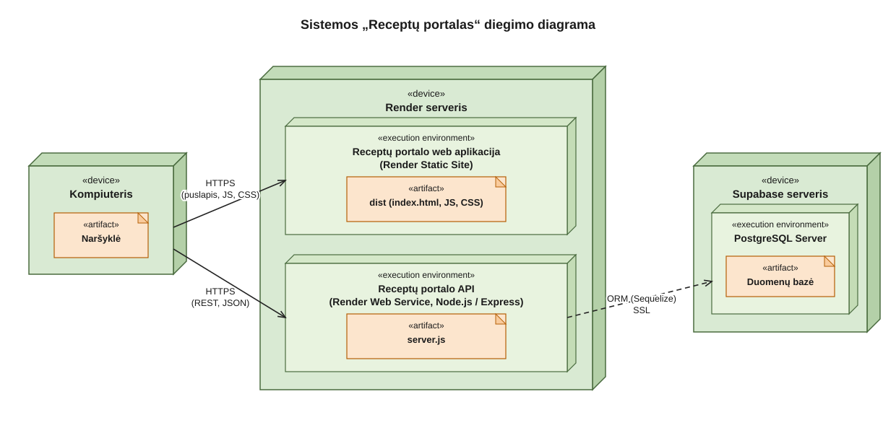
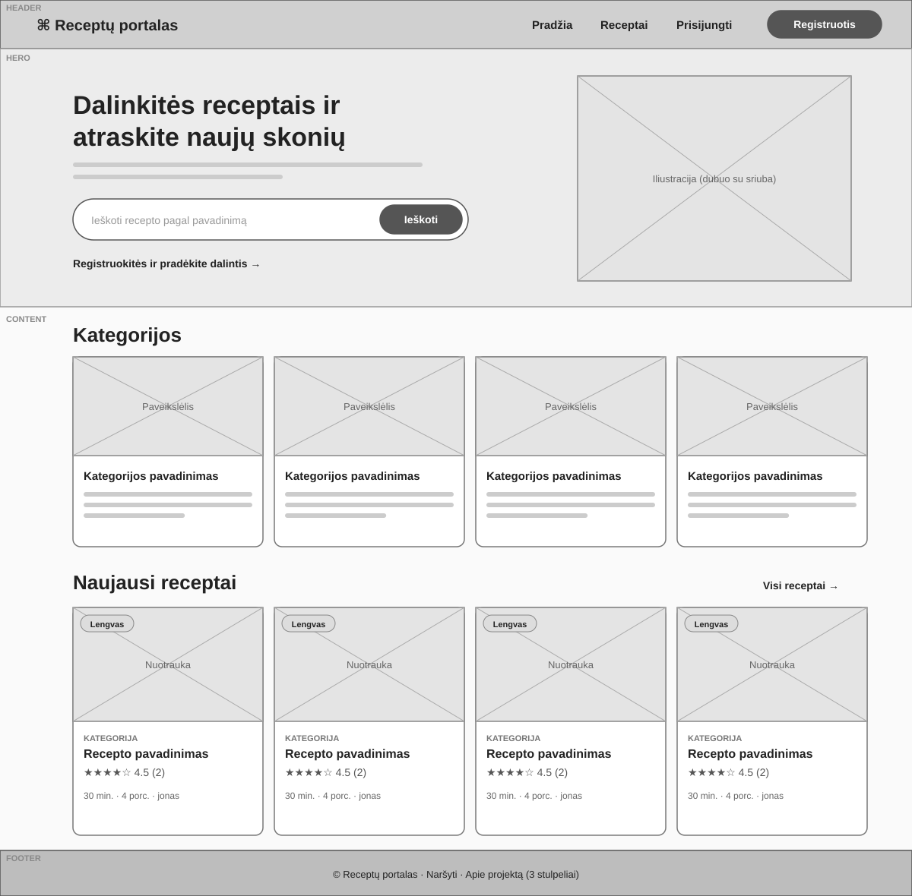
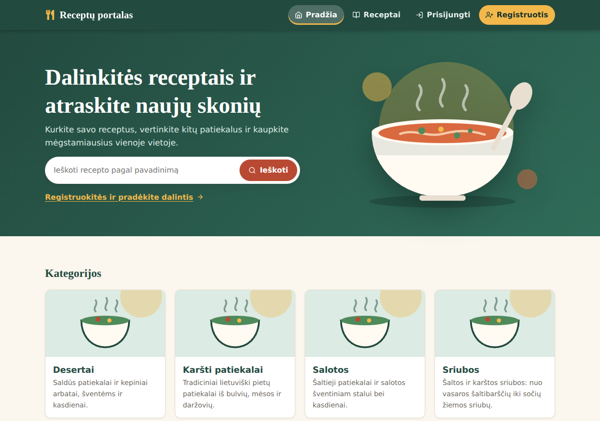
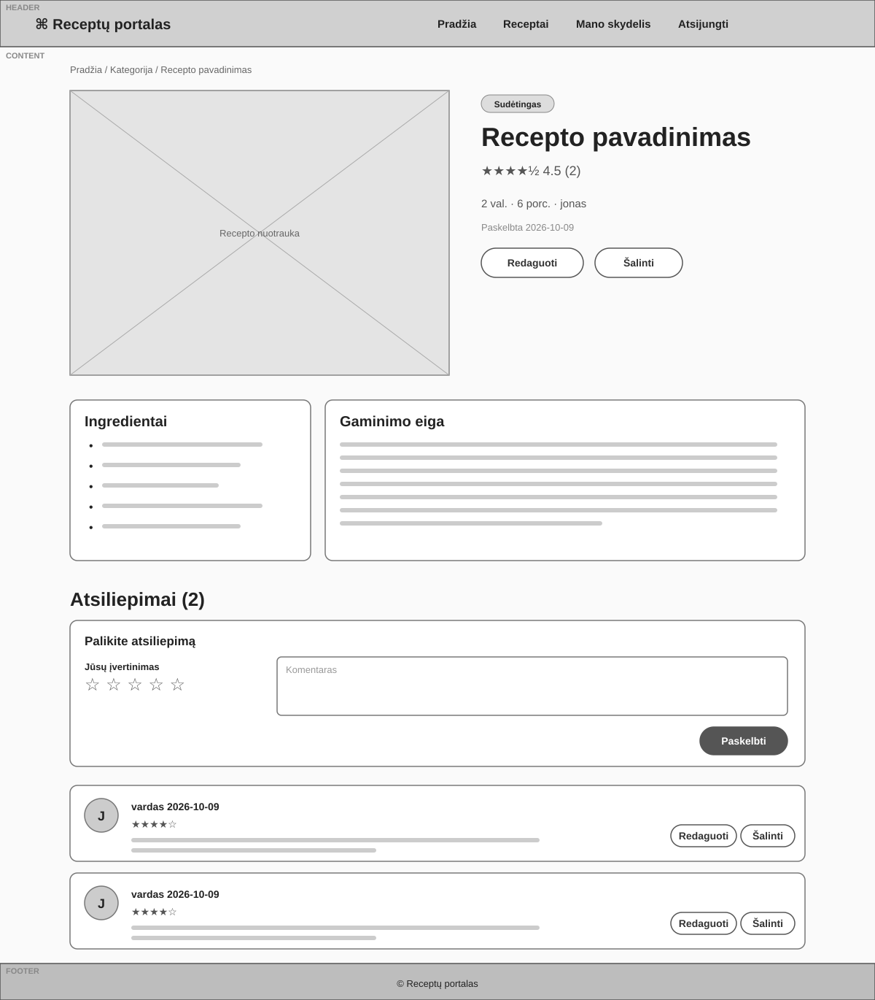
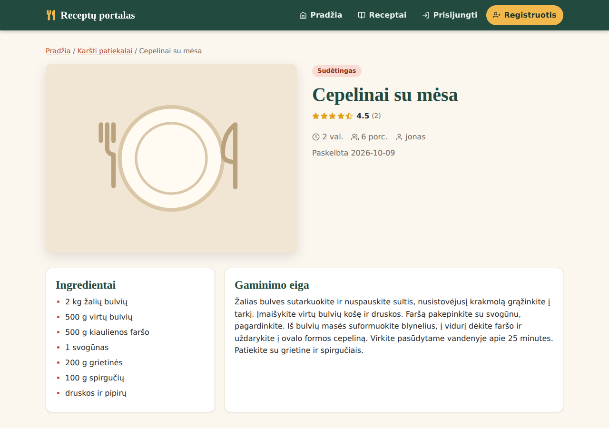
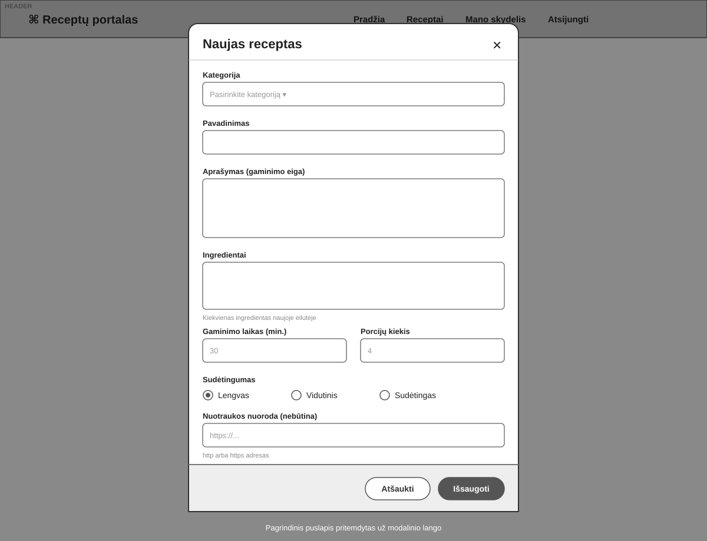
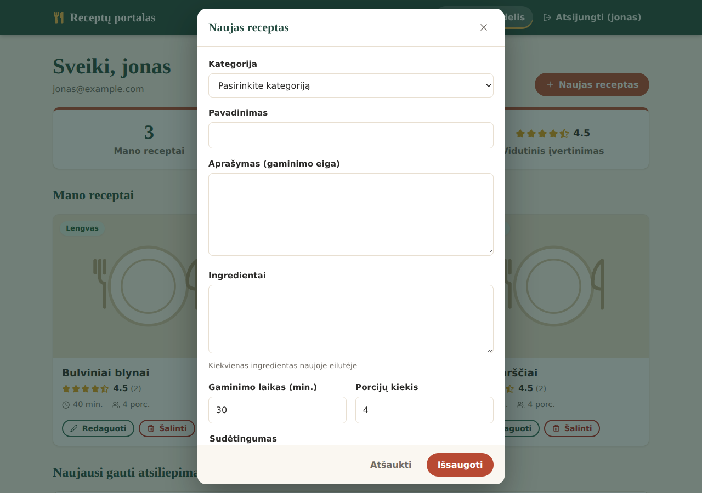
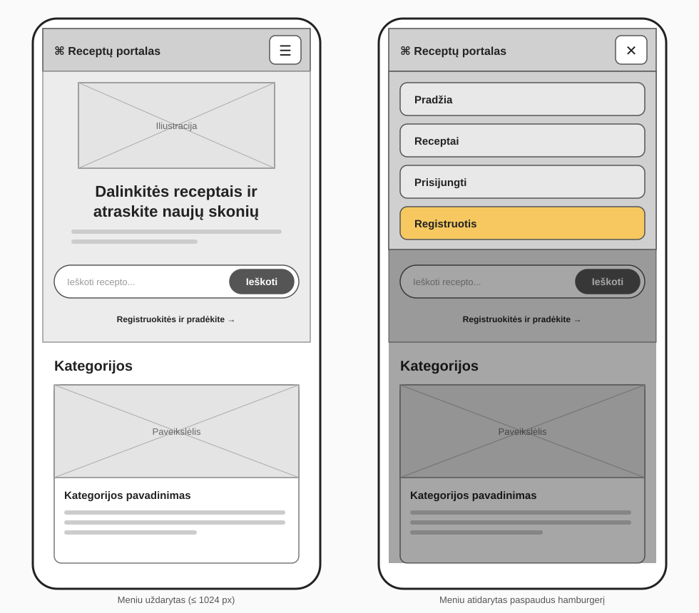
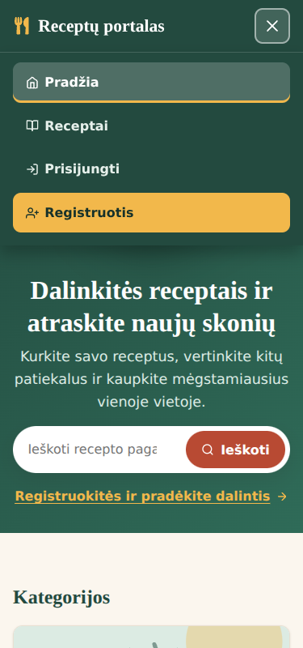

# Receptų portalas

T120B165 Saityno taikomųjų programų projektavimas, Kauno technologijos universitetas, Informatikos fakultetas.
Studentas: Gustas Valaika, IF-4. Dėstytojai: Lukas Navickas, Rasa Mažutienė.

Veikianti sistema (adresai įrašomi po diegimo, žr. skyrių „Diegimas ir nuorodos“):

- Front-End: ____
- API: ____
- API dokumentacija (Swagger UI): ____/api-docs

## 1. Sprendžiamo uždavinio aprašymas

### 1.1. Sistemos paskirtis

Projekto tikslas yra internetinė platforma, kurioje registruoti naudotojai kuria, skelbia ir dalijasi maisto gaminimo receptais, o kiti naudotojai juos peržiūri, komentuoja ir vertina.

Platformą sudaro dvi dalys: internetinė aplikacija (Front-End), kuria naudojasi svečiai, registruoti naudotojai ir administratorius, ir aplikacijų programavimo sąsaja (API), kuri apdoroja duomenis ir keičiasi jais su duomenų baze.

Naudotojas prisiregistruoja, priskiria savo receptus kategorijoms (pvz. „Sriubos“, „Desertai“), nurodo aprašymą, ingredientus, gaminimo laiką, sudėtingumą ir porcijų kiekį. Kiti naudotojai skelbiamus receptus gali komentuoti ir vertinti 1-5 žvaigždutėmis. Komentaras ir įvertinimas saugomi kartu kaip vienas atsiliepimas. Administratorius tvarko kategorijas ir šalina netinkamą turinį bei naudotojus.

### 1.2. Funkciniai reikalavimai

Svečias (neregistruotas naudotojas) gali:

1. peržiūrėti pradinį puslapį ir receptų kategorijas;
2. peržiūrėti receptų sąrašą ir atskiro recepto informaciją;
3. prisiregistruoti arba prisijungti.

Registruotas naudotojas (rolė `user`) gali:

1. atsijungti;
2. sukurti receptą: pasirinkti kategoriją, nurodyti pavadinimą, aprašymą, ingredientus, gaminimo laiką, sudėtingumą ir porcijų kiekį;
3. redaguoti ir šalinti savo receptus;
4. palikti atsiliepimą (komentarą su įvertinimu 1-5) kito naudotojo receptui, vieną kartą kiekvienam receptui;
5. redaguoti ir šalinti savo atsiliepimus;
6. peržiūrėti savo skydelį: duomenis apie save, savo receptus ir jų gautus atsiliepimus bei įvertinimų vidurkį.

Administratorius (rolė `admin`) gali:

1. kurti, redaguoti ir šalinti receptų kategorijas;
2. šalinti netinkamus receptus ir atsiliepimus;
3. peržiūrėti naudotojų sąrašą ir šalinti naudotojus;
4. peržiūrėti bet kurio naudotojo skydelį.

### 1.3. Duomenų modelis

Objektų hierarchija: kategorija → receptas → atsiliepimas (kiekvienas ryšys vienas su daug). Naudotojas į hierarchiją neįeina, jis tik recepto ar atsiliepimo autorius.

| Lentelė | Laukai |
|---|---|
| Users | id, username (unikalus), email (unikalus), passwordHash, role (`user` arba `admin`), createdAt, updatedAt |
| Categories | id, name (unikalus), description, imageUrl, createdAt, updatedAt |
| Recipes | id, categoryId, authorId, title, description, ingredients, prepTimeMinutes, difficulty (`easy`, `medium`, `hard`), servings, imageUrl, createdAt, updatedAt |
| Comments | id, recipeId, authorId, text, rating (1-5), createdAt, updatedAt. Unikali pora (recipeId, authorId) |
| RefreshTokens | id, userId, tokenHash, expiresAt, revokedAt, createdAt, updatedAt |

Trynimas: kategorijos, kurioje yra receptų, ištrinti negalima (409). Ištrynus receptą, ištrinami jo atsiliepimai. Ištrynus naudotoją, ištrinami jo receptai, atsiliepimai ir sesijos.

## 2. Sistemos architektūra

Sistemos dalys:

- kliento pusė (Front-End): React 19, Vite, React Router, axios;
- serverio pusė (Back-End): Node.js, Express 5, Sequelize 6;
- duomenų bazė: PostgreSQL, talpinama Supabase platformoje.

Back-End ir Front-End talpinami Render platformoje kaip dvi atskiros vykdymo aplinkos, duomenų bazė yra atskirame Supabase serveryje. Naršyklė su Front-End ir API bendrauja HTTPS protokolu (JSON), API su duomenų baze jungiasi per Sequelize ORM su SSL.

2.1 pav. pavaizduota diegimo diagrama. Front-End yra statinė svetainė (Render Static Site), API yra atskira Render Web Service. Naršyklė puslapio failus parsisiunčia iš statinės svetainės, o duomenis ir prisijungimą gauna tiesiogiai iš API (HTTPS, JSON). API su duomenų baze Supabase jungiasi per Sequelize su SSL.



*2.1 pav. Sistemos „Receptų portalas“ diegimo diagrama*

Front-End kodo struktūra (`frontend/src`):

| Aplankas | Paskirtis |
|---|---|
| `pages/` | puslapiai: pradžia, receptų sąrašas, receptas, prisijungimas, registracija, skydelis, administravimas |
| `components/` | pakartotinai naudojami elementai: antraštė, poraštė, modaliniai langai, formos, receptų kortelė, žvaigždučių įvertinimas, puslapiavimas |
| `api/` | axios egzempliorius (`client.js`) su žetonų atnaujinimu ir klaidų tekstų pagalbinės funkcijos |
| `context/` | `AuthContext`: prisijungęs naudotojas, prisijungimas, registracija, atsijungimas |
| `hooks/` | `useFetch`: GET užklausa su krovimo ir klaidos būsenomis |
| `styles.css`, `*.css` | bendras stilius (spalvų kintamieji) ir komponentų stiliai |

Būsena laikoma React viduje: prisijungęs naudotojas `AuthContext`, puslapių duomenys `useState` per `useFetch`, filtrai ir puslapis adreso parametruose. Access žetonas laikomas tik atmintyje (`api/client.js`), o perkrovus puslapį atgaunamas per refresh cookie.

Back-End kodo struktūra (`backend/src`):

| Aplankas | Paskirtis |
|---|---|
| `routes/` | keliai ir middleware grandinė kiekvienam metodui |
| `controllers/` | užklausos logika ir atsakymo sudarymas |
| `middleware/` | `authenticate`, `authorize`, `ownership`, ID ir kūno validacija, resursų paieška (`loaders`), klaidų apdorojimas |
| `validators/` | zod schemos užklausos kūnui |
| `models/` | Sequelize modeliai ir ryšiai |
| `utils/` | žetonai, puslapiavimas, hypermedia nuorodos, klaidų klasė |

Middleware tvarka apsaugotame kelyje: `authenticate` (401) → `authorize` (403 pagal rolę) → ID tikrinimas (400) → resurso paieška (404) → nuosavybės patikra (403) → kūno validacija (422) → kontroleris.

## 3. Naudotojo sąsajos projektas

Sąsaja sukurta nuo wireframe: pirma suprojektuoti keturi langai, tada jie realizuoti. Wireframe yra SVG formatu (`docs/wireframes`), juos galima atidaryti ar importuoti į Figmą. Visi langai turi tris sritis (antraštė, turinys, poraštė) ir prisitaiko prie ekrano: iki 768 px meniu paslepiamas už hamburgerio, tinkleliai tampa vienu stulpeliu, lentelės virsta kortelėmis.

**1. Pradžios puslapis**

| Wireframe | Realizacija |
|---|---|
|  |  |

**2. Recepto puslapis** (receptas, ingredientai, gaminimo eiga, atsiliepimai ir jų forma)

| Wireframe | Realizacija |
|---|---|
|  |  |

**3. Recepto forma** (modalinis langas kūrimui ir redagavimui)

| Wireframe | Realizacija |
|---|---|
|  |  |

**4. Telefono versija** (hamburger meniu)

| Wireframe | Realizacija |
|---|---|
|  |  |

Papildomi langai: [mano skydelis](docs/screenshots/skydelis.png) ir [administravimas](docs/screenshots/administravimas.png).

Sąsajos sprendimai:

- spalvų paletė laikoma CSS kintamuosiuose (`styles.css`): terakota pagrindiniams veiksmams, žalia antraštei ir poraštei, medaus spalva akcentams;
- šriftai iš Google Fonts: Nunito (tekstas) ir Playfair Display (antraštės). Lietuviškas raides turi latin-ext poaibis, kurį Google Fonts prideda pats;
- ikonos yra SVG (`react-icons`), iliustracijos SVG failai `frontend/public/images`;
- antraštė, turinys ir poraštė turi skirtingą stilių (pvz. antraštėje nuorodos yra tabletės, turinyje pabraukiamos, poraštėje paprastos);
- duomenų įvedimui naudojami: tekstas, el. paštas, slaptažodis, textarea, select, number, radio, url ir žvaigždučių pasirinkimas;
- grįžtamasis ryšys: pranešimai (toast), klaidos prie formos laukų, krovimo, tuščio sąrašo ir klaidos būsenos. Naršyklės `alert()` ir `confirm()` nenaudojami, trynimas patvirtinamas modaliniame lange;
- animacijos: kortelių ir mygtukų `transition`, `@keyframes` modalinio lango atsiradimui, krovimo rateliui ir turinio atsiradimui.

## 4. API specifikacija

Pilna OpenAPI 3.0 specifikacija: [docs/api-spec.yaml](docs/api-spec.yaml). Kiekvienam metodui ten pateikti aprašas, galimi atsako kodai ir užklausos bei atsakymo pavyzdžiai. Paleidus serverį, ji matoma Swagger UI adresu `/api-docs`.

### 4.1. Metodai

Žymėjimas: „viešas“ reiškia, kad žetono nereikia.

| Metodas | Adresas | Kas gali | Sėkmės kodas |
|---|---|---|---|
| POST | `/api/auth/register` | viešas | 201 |
| POST | `/api/auth/login` | viešas | 200 |
| POST | `/api/auth/refresh` | viešas (reikia refresh cookie) | 200 |
| POST | `/api/auth/logout` | viešas | 204 |
| GET | `/api/auth/me` | prisijungęs | 200 |
| GET | `/api/categories` | viešas | 200 |
| POST | `/api/categories` | admin | 201 |
| GET | `/api/categories/{categoryId}` | viešas | 200 |
| PUT | `/api/categories/{categoryId}` | admin | 200 |
| DELETE | `/api/categories/{categoryId}` | admin | 204 |
| GET | `/api/categories/{categoryId}/recipes` | viešas | 200 |
| POST | `/api/categories/{categoryId}/recipes` | prisijungęs | 201 |
| GET | `/api/categories/{categoryId}/recipes/{recipeId}` | viešas | 200 |
| PUT | `/api/categories/{categoryId}/recipes/{recipeId}` | recepto autorius | 200 |
| DELETE | `/api/categories/{categoryId}/recipes/{recipeId}` | autorius arba admin | 204 |
| GET | `/api/recipes` | viešas | 200 |
| GET | `/api/categories/{categoryId}/recipes/{recipeId}/comments` | viešas | 200 |
| POST | `/api/categories/{categoryId}/recipes/{recipeId}/comments` | prisijungęs, ne recepto autorius | 201 |
| GET | `/api/categories/{categoryId}/recipes/{recipeId}/comments/{commentId}` | viešas | 200 |
| PUT | `/api/categories/{categoryId}/recipes/{recipeId}/comments/{commentId}` | atsiliepimo autorius | 200 |
| DELETE | `/api/categories/{categoryId}/recipes/{recipeId}/comments/{commentId}` | autorius arba admin | 204 |
| GET | `/api/users` | admin | 200 |
| GET | `/api/users/{userId}/dashboard` | pats naudotojas arba admin | 200 |
| DELETE | `/api/users/{userId}` | admin | 204 |

Sąrašai (`GET` kolekcijos) puslapiuojami parametrais `page` ir `limit` (numatytasis 10, daugiausia 50) ir filtruojami: kategorijos pagal `search`, receptai pagal `difficulty`, `maxTime`, `search` (bendrame sąraše dar `categoryId`, `authorId`), atsiliepimai pagal `minRating`. Atsakymuose yra hypermedia nuorodos `_links`.

### 4.2. Atsako kodai

| Kodas | Reikšmė |
|---|---|
| 200, 201, 204 | sėkmė (201 su `Location` antrašte, 204 be atsakymo kūno) |
| 400 | blogas ID, užklausos parametras arba sugadintas JSON |
| 401 | nėra žetono, jis negalioja arba sesija atšaukta |
| 403 | prisijungęs, bet neturi teisės (rolė arba svetimas turinys), recepto autorius vertina savo receptą |
| 404 | resurso nėra arba jis priklauso kitam tėviniam resursui (pvz. receptas kitoje kategorijoje) |
| 409 | pažeistas unikalumas (el. paštas, kategorijos pavadinimas), kategorija su receptais, antras atsiliepimas |
| 422 | JSON teisingas, bet laukų reikšmės netinkamos (`error.details` išvardija laukus) |

Klaidos formatas visada toks: `{ "error": { "status": 404, "message": "...", "details": null } }`.

### 4.3. Autentifikacija ir autorizacija

Naudojami JWT žetonai.

| Žetonas | Turinys ir galiojimas | Kur laikomas |
|---|---|---|
| Access | JWT, HS256. Turinys: `sub` (naudotojo ID), `role`, `sid` (sesijos ID), `iat`, `exp`. Galioja 15 min. | siunčiamas antraštėje `Authorization: Bearer ...` |
| Refresh | atsitiktinė 96 simbolių eilutė (ne JWT). Galioja 7 d. Duomenų bazėje saugomas tik jos SHA-256 hash | `refreshToken` cookie: `HttpOnly`, `Path=/api/auth`, gamyboje `Secure` ir `SameSite=None` |

Eiga:

1. `POST /api/auth/login` sukuria sesiją (eilutę `RefreshTokens`), grąžina access žetoną ir nustato refresh cookie.
2. Pasibaigus access žetonui klientas kviečia `POST /api/auth/refresh`. Senasis refresh žetonas atšaukiamas, išduodamas naujas (rotacija), todėl panaudotas žetonas antrą kartą nebeveikia.
3. `POST /api/auth/logout` atšaukia sesiją ir išvalo cookie. `authenticate` kiekvienoje užklausoje tikrina, ar žetone nurodyta sesija vis dar aktyvi, todėl po atsijungimo nustoja veikti ir dar nepasibaigęs access žetonas.

Rolės ir teisės:

| Veiksmas | Svečias | user | admin |
|---|---|---|---|
| Viešų duomenų skaitymas (kategorijos, receptai, atsiliepimai) | taip | taip | taip |
| Kategorijų kūrimas, keitimas, šalinimas | 401 | 403 | taip |
| Recepto kūrimas | 401 | taip | taip |
| Recepto keitimas | 401 | tik savo | tik savo |
| Recepto šalinimas | 401 | tik savo | bet kurio |
| Atsiliepimo kūrimas | 401 | taip (ne savo recepto, vienas receptui) | taip (tos pačios taisyklės) |
| Atsiliepimo keitimas | 401 | tik savo | tik savo |
| Atsiliepimo šalinimas | 401 | tik savo | bet kurio |
| Naudotojų sąrašas, naudotojo šalinimas | 401 | 403 | taip |
| Skydelis `/users/{id}/dashboard` | 401 | tik savo | bet kurio |

Saugumo sprendimai:

- autorius (`authorId`) imamas iš žetono, užklausos kūne atsiųstas `authorId` ar `role` ignoruojami;
- registracija visada sukuria rolę `user`, administratorius kuriamas tik duomenų bazėje (seed);
- slaptažodžiai saugomi kaip bcrypt hash, blogas el. paštas ir blogas slaptažodis grąžina tą pačią žinutę;
- užklausų kūnas tikrinamas zod schemomis, SQL užklausas sudaro Sequelize su parametrais;
- slaptas raktas (`JWT_ACCESS_SECRET`) laikomas aplinkos kintamajame, ne kode;
- `helmet` pridedamos saugumo antraštės, CORS leidžia tik `FRONTEND_URL` adresą.

### 4.4. Panaudojimo pavyzdžiai

Prisijungimas:

```
POST /api/auth/login
{ "email": "jonas@example.com", "password": "Slaptazodis123!" }

200 OK
Set-Cookie: refreshToken=...; Path=/api/auth; HttpOnly
{ "accessToken": "eyJ...", "tokenType": "Bearer", "expiresIn": 900,
  "user": { "id": 2, "username": "jonas", "email": "jonas@example.com", "role": "user", "createdAt": "..." } }
```

Recepto sukūrimas (autorius paimamas iš žetono):

```
POST /api/categories/5/recipes
Authorization: Bearer eyJ...
{ "title": "Sumustiniai su lašiša", "description": "Duona patepama sviestu, dedama lašiša ir agurkai.",
  "ingredients": "4 riekės duonos\n100 g lašišos", "prepTimeMinutes": 10, "difficulty": "easy", "servings": 2 }

201 Created
Location: /api/categories/5/recipes/11
```

Svetimo recepto keitimas:

```
PUT /api/categories/5/recipes/11
Authorization: Bearer <kito naudotojo žetonas>

403 Forbidden
{ "error": { "status": 403, "message": "Šį veiksmą gali atlikti tik turinio autorius", "details": null } }
```

Daugiau pavyzdžių yra kiekvieno metodo aprašyme `docs/api-spec.yaml` faile.

## 5. Išvados

1. Hierarchinis API kelias (kategorija → receptas → atsiliepimas) kartu su resurso paieška viduriniame sluoksnyje (`middleware/loaders.js`) užtikrina, kad receptas pasiekiamas tik per savo kategoriją, o atsiliepimas tik per savo receptą, kitu atveju grąžinamas 404. Dėl to adresas vienareikšmiškai nurodo resursą, o kontroleriai gauna jau patikrintą objektą. Kaina yra papildomi tarpiniai sluoksniai kiekviename kelyje.
2. Autentifikacijai pasirinktas trumpas access žetonas (15 min.) ir ilgesnis refresh žetonas (7 d.) su rotacija. Refresh žetonas saugomas duomenų bazėje tik kaip hash, todėl nutekėjus duomenų bazei juo pasinaudoti negalima. Kiekvienas panaudotas refresh žetonas atšaukiamas, todėl pavogtas ir jau panaudotas žetonas nebeveikia.
3. Atsijungimas atšaukia sesiją duomenų bazėje, o `authenticate` kiekvienoje užklausoje tikrina, ar sesija aktyvi. Gavome tai, ko nepasiektų vien JWT: po atsijungimo nustoja veikti ir dar nepasibaigęs access žetonas. Kaina yra viena papildoma duomenų bazės užklausa kiekvienam apsaugotam metodui.
4. Rolė saugoma žetone, todėl teisių tikrinimui nereikia duomenų bazės, bet pakeista rolė įsigalioja tik pasibaigus senam access žetonui (iki 15 min.). Autorius (`authorId`) imamas iš žetono, o užklausos kūne atsiųsti `authorId` ir `role` ignoruojami, todėl negalima kurti turinio kito naudotojo vardu ar tapti administratoriumi per registraciją.
5. Nuosavybės patikra (`middleware/ownership.js`) atskirta nuo rolės patikros (`authorize`). Dėl to aiškiai skiriasi 401 (nežinome, kas jūs), 403 (žinome, bet negalite) ir 404 (tokio resurso nėra), o bendra logika naudojama receptams, atsiliepimams ir skydeliui.
6. Front-End access žetoną laiko tik atmintyje, o ne `localStorage`, todėl jo negali perskaityti kiti skriptai iš naršyklės saugyklos. Perkrovus puslapį sesija atkuriama per refresh cookie. Kai kelios užklausos vienu metu gauna 401, žetonas atnaujinamas vieną kartą, nes antras refresh su jau panaudotu žetonu būtų atmestas.
7. Front-End ir API yra skirtinguose domenuose, todėl refresh cookie turi `SameSite=None` ir `Secure`. Kai kurios naršyklės blokuoja trečiųjų šalių slapukus, todėl tokiose naršyklėse po puslapio perkrovimo gali tekti prisijungti iš naujo. Visiškai išspręsti tai galėtų bendras domenas Front-End ir API adresams.
8. Nemokami Render planai po nenaudojimo užmiega, todėl pirmas atsakymas gali užtrukti iki minutės. Sąsaja tai paaiškina krovimo ekrane (pranešimas po kelių sekundžių), o prieš demonstraciją abu serverius reikia pažadinti.
9. Neįgyvendinta: apsauga nuo slaptažodžių brutalaus bandymo (užklausų dažnio ribojimas), dviejų faktorių autentifikacija, visų sesijų atšaukimas aptikus pakartotinį refresh žetono naudojimą ir nuotraukų įkėlimas (receptams nurodoma nuoroda į nuotrauką). Tai natūralūs tolesni žingsniai.

## Diegimas ir nuorodos

Sistema diegiama Render platformoje (Back-End ir Front-End atskirai), duomenų bazė yra Supabase.

| Paslauga | Render nustatymai |
|---|---|
| API (Web Service) | Root Directory: nenurodyti (turi būti viso repozitorijos šaknis, nes API skaito `docs/api-spec.yaml`). Build Command: `cd backend && npm install`. Start Command: `cd backend && node src/server.js`. Aplinkos kintamieji: `NODE_ENV=production`, `DATABASE_URL`, `JWT_ACCESS_SECRET`, `FRONTEND_URL` (Front-End adresas be pasvirojo brūkšnio pabaigoje) |
| Front-End (Static Site) | Root Directory: `frontend`. Build Command: `npm install && npm run build`. Publish Directory: `dist`. Aplinkos kintamasis: `VITE_API_URL` (API adresas su `/api`, pvz. `https://.../api`). Rewrite taisyklė: `/*` → `/index.html` |

`VITE_API_URL` įrašomas į programą kūrimo metu, todėl jį pakeitus Front-End reikia perkurti (Manual Deploy).

Nuorodos: Front-End ____, API ____, Swagger UI ____/api-docs, kodas https://github.com/gustas215/recipe-portal.

## Paleidimas lokaliai

Reikia Node.js (LTS) ir PostgreSQL duomenų bazės (pvz. Supabase projekto).

1. Aplanke `backend` įdiegti paketus: `npm install`.
2. Sukurti `backend/.env` pagal `backend/.env.example` (`DATABASE_URL`, `JWT_ACCESS_SECRET`, `FRONTEND_URL`, `PORT`). Slaptą raktą galima sugeneruoti komanda `node -e "console.log(require('crypto').randomBytes(64).toString('hex'))"`.
3. Užpildyti duomenų bazę: `npm run seed`. Komanda ištrina ir sukuria lenteles iš naujo.
4. Paleisti serverį: `npm run dev`. API pasiekiamas adresu `http://localhost:3000/api`, dokumentacija `http://localhost:3000/api-docs`.
5. Kitame terminale aplanke `frontend` įdiegti paketus (`npm install`) ir paleisti sąsają: `npm run dev`. Sąsaja pasiekiama adresu `http://localhost:5173`. API adresas imamas iš `VITE_API_URL` (pagal `frontend/.env.example`), o jei jo nėra, naudojamas `http://localhost:3000/api`. Back-End `FRONTEND_URL` turi būti `http://localhost:5173`.

Testiniai naudotojai (po `npm run seed`): `admin@example.com` / `Admin123!` (administratorius), `jonas@example.com`, `ruta@example.com`, `mantas@example.com` / `Slaptazodis123!` (paprasti naudotojai).

Testavimas: Postman kolekcija `postman/recipe-portal.postman_collection.json`. Importuoti į Postman, paleisti visą kolekciją per Runner (išjungti „Stop run if an error occurs“). Pirmas aplankas prisijungia keturiais naudotojais ir išsaugo žetonus, todėl kolekciją reikia leisti iš karto, žetonai galioja 15 min. Prieš kiekvieną paleidimą vykdyti `npm run seed`, nes aplankas 8 ištrina naudotoją.
